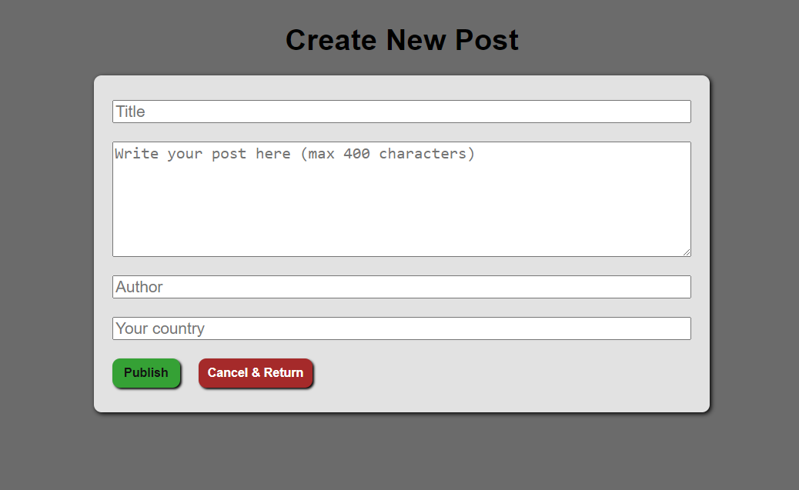
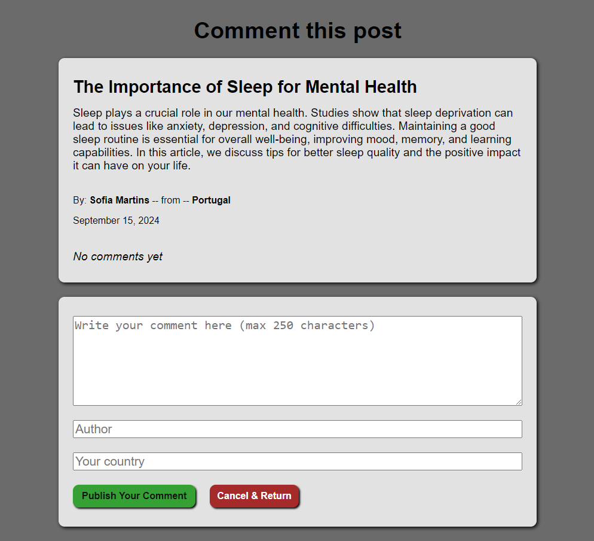

If you are using it online (via onrender in this case):
- because the backend is running the changes you make may take some time to reset,
so if you want to reset any change you have made, please use the reset button on the homepage.

If using it locally, just refresh the api.js via terminal

Info local usage:

API (api.js) will run on localhost port 4000
the app (index.js) will run on localhost port 3000

So the API url is: http://localhost:4000

How to run the app:

    On the terminal:
        1. cd to the frontend folder
        2. npm i
        3. nodemon index.js

    Open another terminal (for the API):
        1. cd to the backend folder
        2. nodemon api.js

Done.

This was a capstone project on my web Dev journey.
The point of the challenge was to make an application implementing api creation , create communication between the front and back end (get, post, patch and delete) and present the data with a user friendly visuals.

Extra mile:
I implemented a comment feature.
So the user can see all the comments made in each post and add a new comment to any specific post.
This came with a little bigger challenge than i expected, because i added the comments as an array of objects inside the main array of objects, and that came a bit trick, not much, but i am a beginner so i struggled a bit. In the end i am glad i did work for this feature because i learned more.
Now much more easily i could have implemented the "edit" and "delete" features on the comments, but i think that would be much more repetitive for the point of the challenge for now. 

Also i know this would be usable only with authentication , so only the author could edit or delete the posts or the comments, but it is not a subject that i have yet dived in, so, probably later i can implement it.

Homepage screenshot:

New blog post screenshot:

Write comment screenshot:

Read comments page screenshot:

